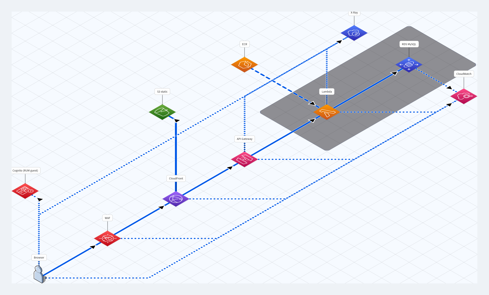

# djaret

A small Django REST app that runs as a **container image on AWS Lambda**, served
to the public through CloudFront + API Gateway, with the entire stack — network,
data, identity, observability and CI/CD — defined in Terraform. Live at
**[www.yaret.cloud](https://www.yaret.cloud)**.

The application is deliberately minimal (a single `GET /api/hello/` endpoint);
the focus is the **production platform around it**: IAM-auth database access,
full CloudWatch observability (RUM ↔ X-Ray ↔ Application Signals), least-privilege
OIDC pipelines, and hash-locked, scanned dependency supply chains.



```
Browser ─▶ WAF ─▶ CloudFront ─┬─▶ S3            (static site, OAC SigV4)
                              └─▶ API Gateway ─▶ Lambda (Django) ─▶ RDS MySQL
                                                 (REST v1, X-Ray)    (IAM auth, in VPC)
RUM beacons ─▶ CloudWatch ◀─ X-Ray / Application Signals ◀─ Lambda
```

---

## Stack

| Layer        | Choice                                                              |
|--------------|--------------------------------------------------------------------|
| Runtime      | Python 3.12, Django 6 + DRF, on Lambda **container** image (arm64) |
| Edge         | CloudFront (alias `www.yaret.cloud`, ACM cert) + WAFv2             |
| API          | API Gateway **REST v1** (REGIONAL), X-Ray tracing on              |
| Data         | RDS MySQL, accessed via **IAM database authentication**           |
| Static       | S3 bucket, served through CloudFront with Origin Access Control   |
| Front-end    | Vanilla JS + CloudWatch RUM (real-user monitoring)                |
| Observability| RUM, X-Ray, Application Signals (SLOs), Application Insights      |
| IaC          | Terraform (`aws ~> 6`, `awscc ~> 1`, `random`), S3 remote state    |
| CI/CD        | Two GitHub Actions pipelines, OIDC, SonarCloud + Trivy gates      |

---

## Repository layout

```
djaret/                  Django project (config + entrypoints)
  settings.py            env-driven; dummy DB unless DB_HOST is set
  urls.py                /admin, /api/hello/
  wsgi.py · asgi.py
  db_backends/iam_mysql/ custom DB backend: RDS IAM-auth tokens
djaret_app/              the application
  views.py               HelloView (DRF APIView)
  models.py              Service (managed=False, external table)
  tests.py               DB-free unit tests (mocked Service)
lambda_handler.py        apig-wsgi adapter: API GW proxy event → Django WSGI
manage.py
frontend/                static site (index.html, app.js, app.css) + RUM
Dockerfile               multistage build, bakes ADOT layer, non-root user
requirements*.txt        hash-locked runtime + dev deps (pip --require-hashes)
terraform/               all infrastructure (see below)
.github/workflows/       ci-cd.yml (app) · terraform.yml (infra)
```

---

## Application layer

**Entrypoint.** `lambda_handler.py` wraps the Django WSGI app with
[`apig-wsgi`](https://pypi.org/project/apig-wsgi/), turning API Gateway proxy
events into WSGI calls. It does **not** initialise telemetry — the ADOT layer's
exec wrapper (`AWS_LAMBDA_EXEC_WRAPPER=/opt/otel-instrument`) auto-instruments
the runtime and lazy-imports the handler.

**Database — IAM auth, no passwords.** `djaret/db_backends/iam_mysql/` subclasses
Django's MySQL backend and injects a short-lived **RDS IAM auth token** as the
connection password. The boto3 RDS client is built once at module scope (folded
into Lambda static init), and tokens are cached for 13 min (RDS tokens live 15).
TLS is enforced with the bundled RDS global CA. When `DB_HOST` is unset (CI,
local), settings fall back to Django's dummy backend so nothing needs a database.

**Model.** `Service` is `managed = False` against an external table
`djaret_app_service`; `HelloView` returns `Hello from <service name>` or
`Hello from Lambda` when the table is empty/unreachable.

**Tests.** `djaret_app/tests.py` uses `SimpleTestCase` + a mocked `Service`, so
they run with no MySQL and no migrations — coverage is reported to SonarCloud.

**Front-end.** `frontend/app.js` calls `/api/hello/` same-origin (CloudFront
routes `/api/*` to the API, so no CORS). Errors are re-thrown so CloudWatch RUM
captures them; `index.html` boots the RUM web client with a build-stamped
release id.

**Container.** Multistage `Dockerfile`: a builder compiles `mysqlclient` and
extracts the ADOT layer; the slim runtime carries only the shared lib, runs
`compileall` for faster cold starts, and executes as a **non-root** user.

---

## Infrastructure layer (`terraform/`)

State lives in S3 (`djaret-tfstate`, native S3 lockfile, encrypted). Everything
is workspace-scoped (`pro`). Built almost entirely from **official
`terraform-aws-modules`**, pinned by tag:

| Concern        | Module / resource                                              |
|----------------|----------------------------------------------------------------|
| Network        | `terraform-aws-vpc` — private subnets host Lambda + RDS        |
| Compute        | `terraform-aws-lambda` — container image from ECR, arm64       |
| Registry       | `terraform-aws-ecr`                                            |
| Database       | `terraform-aws-rds` — MySQL, enhanced monitoring, KMS          |
| Edge           | `terraform-aws-cloudfront` (OAC to S3) + `terraform-aws-wafv2` |
| Certs          | `terraform-aws-acm`                                            |
| Static hosting | `terraform-aws-s3-bucket` + bucket policy                     |
| API            | raw `aws_api_gateway_*` (REST v1, `{proxy+}` → Lambda)         |
| Identity       | `terraform-aws-iam` (OIDC provider, scoped roles, policies)    |
| Logs           | `terraform-aws-cloudwatch//modules/log-group` (API GW, CF, WAF)|
| Front-end RUM  | `aws_rum_app_monitor` + Cognito identity pool (guest role)     |
| Security groups| `terraform-aws-security-group` (lambda_sg, rds_sg)            |

CloudFront standard **logging v2** delivers access logs straight to a CloudWatch
log group (queryable out of the box). The `us-east-1` provider alias exists for
the edge-region resources WAF/CloudFront logging requires.

**Secrets.** `DJANGO_SECRET_KEY` is generated by `random_password` and passed to
the Lambda as an environment variable; it is not stored in the repository.

---

## Observability

- **RUM** — browser performance + JS errors, auth'd via a Cognito guest role.
- **X-Ray** — tracing on the REST v1 API and the Lambda; an indexing rule keeps
  Transaction Search at 100% sampling. RUM traces stitch to backend traces
  through the v1 API (v2 lacks X-Ray and would break the stitch).
- **Application Signals** — SLOs (availability + latency for backend and API)
  codified via the `awscc` provider.
- **Application Insights** — auto-discovered problem detection over the resource
  group.

---

## CI/CD

Two OIDC-authenticated GitHub Actions pipelines, each gated by SonarCloud
(`sonar.qualitygate.wait=true`) and Trivy (fails on HIGH/CRITICAL):

**`ci-cd.yml` — application.** On push: install hash-locked deps, run tests +
coverage, Sonar scan, build the arm64 image, Trivy-scan it, push to ECR, update
the Lambda function code, sync static/front-end to S3, invalidate CloudFront,
and write the image tag back into `terraform/image.auto.tfvars`. A short-lived
S3 object guards against racing the Terraform state lock.

**`terraform.yml` — infrastructure.** On `terraform/**` changes: init, validate,
Sonar + Trivy (IaC + pipeline) scans, `plan` (uploaded as an artifact), then a
gated `apply` job bound to the `production` environment (manual approval).

**Supply chain.** All `requirements*.txt` are hash-locked and installed with
`pip --require-hashes --only-binary` (carve-out only for `mysqlclient`). Every
GitHub Action is pinned to a commit SHA.

---

## Local development

```bash
python -m venv .venv && source .venv/bin/activate
pip install --require-hashes -r requirements.txt
python manage.py test djaret_app      # DB-free, no MySQL needed
python manage.py runserver            # dummy DB backend (DB_HOST unset)
```

Build the Lambda image locally:

```bash
docker build -t djaret .
```

Deploy is push-to-`master` (the pipelines do the rest); infra changes go through
the gated Terraform pipeline.
